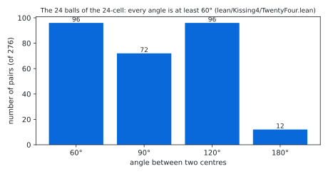
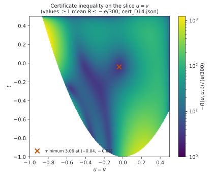
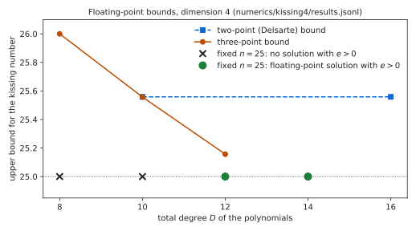

# The kissing number in dimension 4: a Lean 4 formalisation with a three-point certificate

Status: **Lean 4 formalisation, not peer reviewed.** Prepared 2026-10-07. **Produced by AI models** under the direction
of the repository owner; see [`AI_DISCLOSURE.md`](AI_DISCLOSURE.md).

> [!IMPORTANT]
> This repository is a public, timestamped, AI-produced **warrant** for a Lean 4 proof that the kissing number in
> dimension 4 is 24, a theorem of O. R. Musin (Ann. of Math. 168 (2008)): a machine-checked argument that no human has
> yet digested. The theorem was settled in 2008; we do not regard this formal argument as settled until it has been
> checked independently.
> Independent verification and human-readable expositions are welcome, and credit for a human-readable proof belongs
> to whoever writes one. To refer to the computational result, please cite the archived repository (Zenodo DOI to be
> added on archiving). Questions, checks and corrections:
> [GitHub issues](https://github.com/alejandrozarco/kissing-number-4/issues).

The kissing number $`\kappa(d)`$ is the largest number of non-overlapping unit balls in $`\mathbb{R}^d`$ that touch a
common unit ball. `lean/Kissing4/Statement.lean` states, and the Lean kernel checks in `lean/Kissing4/Solution.lean`:

```math
\kappa(4) = 24 .
```

The lower bound uses the 24 vertices of the 24-cell, with integer coordinates. The upper bound uses an exact
three-point semidefinite certificate in the sense of Bachoc and Vallentin for 25 points, checked by `decide +kernel`,
together with a Lean proof of the Bachoc–Vallentin positivity theorem on the sphere $`S^3`$ for the degrees used.

## The statement

```lean
abbrev E (d : ℕ) := EuclideanSpace ℝ (Fin d)

def IsKissing {d : ℕ} (S : Set (E d)) : Prop :=
  (∀ x ∈ S, ‖x‖ = 2) ∧ ∀ x ∈ S, ∀ y ∈ S, x ≠ y → 2 ≤ dist x y

noncomputable def kissingNumber (d : ℕ) : ℕ∞ :=
  ⨆ (S : Set (E d)) (_ : IsKissing S), S.encard

theorem exists_isKissing_encard_eq_twentyFour : ∃ S : Set (E 4), IsKissing S ∧ S.encard = 24
theorem encard_le_twentyFour_of_isKissing (S : Set (E 4)) (hS : IsKissing S) : S.encard ≤ 24
theorem kissingNumber_four : kissingNumber 4 = 24
```

`IsKissing S` says that the points of `S` are centres of unit balls that touch the unit ball at the origin (distance
2) and do not overlap each other (pairwise distance at least 2). Sets may be infinite; sizes are counted in `ℕ∞`.
Three further theorems test the definition: two opposite balls form an arrangement, two balls $`30^\circ`$ apart do
not, and a ball at distance 3 does not. The definitions are those of
[kissing-number-3](https://github.com/alejandrozarco/kissing-number-3) with $`d = 4`$;
[`lean/STATEMENT4.md`](lean/STATEMENT4.md) explains every line.

Checks recorded in [`verification/`](verification/):
- Comparator: the six theorems of `lean/comparator4.json` have the statements of `lean/Kissing4/Statement.lean`, use
  only the axioms `propext`, `Quot.sound`, `Classical.choice`, and are accepted by the Lean kernel.
- `#print axioms` for all six: `[propext, Classical.choice, Quot.sound]`.
- A clean build of the modules the proof uses, one at a time from a fresh copy, with wall time and peak memory
  (table below).

The files contain no `sorry` outside the two `Statement.lean` files and no `native_decide`.

## The argument

Any arrangement with more than 24 balls contains 25. Halving their centres gives unit vectors
$`x_1, \dots, x_{25}`$ in $`\mathbb{R}^4`$ with $`\langle x_i, x_j \rangle \le 1/2`$ for $`i \ne j`$. For three unit
vectors write $`(u, v, t)`$ for their pairwise inner products, and let $`\Delta`$ be the set of such triples with
$`u, v, t \le 1/2`$. The certificate consists of positive definite matrices $`F_0, \dots, F_7`$ of sizes 8 to 1. With
the Bachoc–Vallentin matrices $`S_k`$ of $`S^3`$ and

```math
s(u,v,t) = \sum_{k=0}^{7} \langle F_k, S_k(u,v,t) \rangle ,
\qquad
R(u,v,t) = 23\, s(u,v,t) + s(u,u,1) + s(v,v,1) + s(t,t,1) + \frac{1}{24}\, s(1,1,1),
```

it contains a sum-of-squares identity showing

```math
R(u,v,t) \le -\frac{1}{32 \cdot 300} \quad \text{on } \Delta .
```

Summing over all ordered triples of distinct points and using the positivity of $`\sum_{i,j,l} S_k`$ gives
$`1/32 \le 0`$, a contradiction. The polynomials have total degree 14. The sum-of-squares part uses the multipliers
$`1`$, $`1+x`$, $`1-2x`$, $`(1+x)(1-2x)`$ for $`x \in \{u, v, t\}`$ and the Gram determinant
$`1 + 2uvt - u^2 - v^2 - t^2`$, with Gram matrices of sizes 120, 84 (nine times) and 56.

The positivity of $`\sum_{i,j,l} S_k(\langle x_i,x_j\rangle, \langle x_i,x_l\rangle, \langle x_j,x_l\rangle)`$ for
unit vectors of $`\mathbb{R}^4`$ is proved in `lean/Kissing4/Positivity.lean` for $`k \le 7`$: in a frame orthogonal to
$`x_i`$ the kernel becomes a solid Legendre kernel on $`\mathbb{R}^3`$, and the addition theorem for spherical
harmonics (`lean/Kissing4/Addition.lean`, one polynomial identity per degree, generated by `lean/gen/gen_addition4.py`)
writes it as a sum of squares.

| Lean module | content |
|---|---|
| `Kissing4/Kernel.lean` | the kernels of $`S^3`$, the Gram determinant in $`\mathbb{R}^4`$, the three-point identity |
| `Kissing4/Addition.lean` | the addition theorem for the solid Legendre kernels on $`\mathbb{R}^3`$, degrees 0 to 7 |
| `Kissing4/Positivity.lean` | Bachoc–Vallentin positivity on $`S^3`$, degrees 0 to 7 |
| `Kissing4/Bound.lean` | the three-point bound in $`\mathbb{R}^4`$, with the inner products restricted by an arbitrary condition |
| `Kissing4/CertK.lean` | the exact certificate checker for $`\Delta`$ and its soundness theorem |
| `Kissing4/Chunk.lean` | lemmas that split the kernel checks of large blocks into chunks of rows |
| `Kissing4/Cert/` | the certificate data and its `decide +kernel` checks (one module per $`F`$-block, ten rows per module for the SOS blocks) |
| `Kissing4/TwentyFour.lean` | the 24 points: integer coordinates, norm exactly 2, pairwise distance at least 2 |
| `Kissing4/Solution.lean` | the statements of `Kissing4/Statement.lean`, with proofs |

`Kissing4` reuses the dimension-independent certificate format and checker of the dimension-3 development in
`lean/Kissing/`, published as [kissing-number-3](https://github.com/alejandrozarco/kissing-number-3) with its own
verification records. The package here contains both developments; `verification/` holds the records for
`Kissing4`, and in `verification/dim3/` those of the same checks for `Kissing`.

The certificate was found in floating point (`numerics/kissing4/k4.py`), rounded to exact rationals with
denominators dividing $`2^{32} \cdot 75`$ (`numerics/kissing4/round_k4.py`), and checked in exact arithmetic by an
independent script (`numerics/kissing4/check_cert_k4.py`) before the Lean check.

## Figures

Regenerate with `python3 figures/make_figures.py` (matplotlib 3.9.4, numpy); every figure is computed from repository
files only.

<picture>
  <source media="(prefers-color-scheme: dark)" srcset="figures/angles_dark.svg">
  
</picture>

The 276 angles between the 24 centres of the lower bound (`lean/Kissing4/TwentyFour.lean`), seen from the origin.
Two balls touching the central ball overlap exactly when their angle is below $`60^\circ`$; here 96 pairs touch.

<picture>
  <source media="(prefers-color-scheme: dark)" srcset="figures/certificate_dark.svg">
  
</picture>

The certificate inequality $`R \le -e/300`$ with $`e = 1/32`$, evaluated in floating point from `cert_D14.json` on the
slice $`u = v`$ of the region $`\Delta`$ (white: triples that are not inner products of unit vectors). The Lean check
covers all of $`\Delta`$ exactly.

<picture>
  <source media="(prefers-color-scheme: dark)" srcset="figures/bounds_dark.svg">
  
</picture>

Floating-point values from `numerics/kissing4/results.jsonl` (not certified): the two-point (Delsarte) bound stays
above 25.55; the three-point bound computed here is above 25 up to degree 12; the fixed-$`n`$ problem used here has a
solution with positive margin for $`n = 25`$ from degree 12. The certificate is the rounded degree-14 solution.

## Contents

| path | content |
|---|---|
| `lean/` | the Lean package: statement, proof, certificate modules, emitters (`gen/`), `regen.sh`, Comparator configs, build scripts |
| `lean/STATEMENT4.md` | the statement in plain English |
| `numerics/kissing4/` | SDP formulation for $`S^3`$, floating-point solutions, exact rounding, exact checker, the certificate `cert_D14.json` |
| `numerics/kissing3/` | the dimension-3 code that `numerics/kissing4/` builds on (from kissing-number-3) |
| `verification/` | records of the clean build, Comparator, axioms and the upstream-text scan |
| `figures/` | the figures and `make_figures.py` |
| `formalization.yaml` | metadata (mathlib-initiative format v0.4) |
| `AI_DISCLOSURE.md` | how AI models were used, what is checked and what is trusted |
| `LICENSE`, `CITATION.cff` | licence (Apache-2.0) and citation metadata |
| `MANIFEST.sha256` | sha256 of every file |

## Reproduce

Lean (toolchain `leanprover/lean4:v4.34.1`, Mathlib `d13f23b`, both pinned):

```sh
cd lean
./regen.sh                    # regenerates ThomsonGen/*.lean from upstream; checks the eight imported ones by sha256
lake exe cache get
bash scripts/build_test.sh build_test4.tsv "Kissing4.Statement Kissing4.Solution Kissing4.Axioms"
lake env lean Kissing4/Axioms.lean
```

`build_test.sh` compiles every module one at a time; `lake build Kissing4` also works on a machine with enough memory
(the largest module needs about 8.6 GiB). `lean/scripts/run_comparator.sh comparator4.json` runs
[Comparator](https://github.com/leanprover/comparator); without prebuilt tools it fetches and builds them at the
revisions pinned in `lean/scripts/tools.sh`, which also records the sha256 of the binaries used for `verification/`.
`lake build` may compile several modules in parallel; the modules form one import chain to limit this.

Certificate (Python 3, `python-flint`, `numpy`; `cvxpy` with Clarabel only to re-solve; `sympy` only for
`gen_addition4.py`):

```sh
cd numerics/kissing4
python3 check_cert_k4.py cert_D14.json                                    # exact check (about 1 min)
python3 check_controls_k4.py cert_D14.json                                # tampered certificates must be rejected
python3 round_k4.py sol/fixn_D14_n25_mu0.5.npz cert.json 28               # re-round the float solution
python3 ../../lean/gen/emit_k4.py cert_D14.json --outdir /tmp/Cert       # re-emit the Lean data
./run.sh fixn 14 25 && ./run.sh mu 14 25 0.5                              # re-solve (float; about 3 h)
```

## Clean build

The 142 modules reachable from the build roots `Kissing4.Statement`, `Kissing4.Solution` and
`Kissing4.Axioms`, each compiled one at a time (`lean/scripts/build_test.sh`, `lean -j1`) from a fresh copy of
`lean/` after `regen.sh` and `lake exe cache get`, on Linux x86_64 (`verification/build_test4.tsv`). Wall time
includes loading Mathlib for each module. Memory in GiB ($`2^{30}`$ bytes).

Total 2.8 h; largest peak 8.60 GiB (`ThomsonGen.M2`).

<details><summary>Per-module table</summary>

| module | wall (s) | peak RSS (GiB) |
|---|---:|---:|
| `Kissing4.Statement` | 251 | 6.39 |
| `ThomsonGen.Preamble` | 45 | 6.50 |
| `ThomsonGen.ThreePoint` | 47 | 6.53 |
| `ThomsonGen.Kron` | 25 | 6.49 |
| `ThomsonGen.Cert1` | 22 | 6.49 |
| `ThomsonGen.Cert3` | 38 | 6.53 |
| `ThomsonGen.Case1Stat` | 21 | 6.46 |
| `ThomsonGen.M2` | 93 | 8.60 |
| `ThomsonGen.CertF` | 30 | 6.49 |
| `Kissing.Bound` | 22 | 6.47 |
| `Kissing.CertK` | 24 | 6.50 |
| `Kissing4.Kernel` | 32 | 6.54 |
| `Kissing4.Addition` | 218 | 7.21 |
| `Kissing4.Positivity` | 29 | 6.50 |
| `Kissing4.Bound` | 19 | 6.48 |
| `Kissing4.CertK` | 27 | 6.50 |
| `Kissing4.Chunk` | 19 | 6.47 |
| `Kissing4.Cert.Data` | 90 | 6.75 |
| `Kissing4.Cert.ChkF0` | 28 | 6.80 |
| `Kissing4.Cert.ChkF1` | 32 | 6.73 |
| `Kissing4.Cert.ChkF2` | 29 | 6.67 |
| `Kissing4.Cert.ChkF3` | 29 | 6.62 |
| `Kissing4.Cert.ChkF4` | 25 | 6.57 |
| `Kissing4.Cert.ChkF5` | 25 | 6.55 |
| `Kissing4.Cert.ChkF6` | 25 | 6.52 |
| `Kissing4.Cert.ChkF7` | 24 | 6.50 |
| `Kissing4.Cert.ChkS0_0` | 134 | 7.43 |
| `Kissing4.Cert.ChkS0_1` | 160 | 7.54 |
| `Kissing4.Cert.ChkS0_2` | 152 | 7.66 |
| `Kissing4.Cert.ChkS0_3` | 174 | 7.61 |
| `Kissing4.Cert.ChkS0_4` | 183 | 7.82 |
| `Kissing4.Cert.ChkS0_5` | 179 | 7.92 |
| `Kissing4.Cert.ChkS0_6` | 194 | 8.06 |
| `Kissing4.Cert.ChkS0_7` | 175 | 8.16 |
| `Kissing4.Cert.ChkS0_8` | 199 | 8.27 |
| `Kissing4.Cert.ChkS0_9` | 201 | 8.37 |
| `Kissing4.Cert.ChkS0_10` | 184 | 8.48 |
| `Kissing4.Cert.ChkS0_11` | 194 | 8.57 |
| `Kissing4.Cert.ChkS0` | 25 | 6.48 |
| `Kissing4.Cert.ChkS1_0` | 74 | 6.98 |
| `Kissing4.Cert.ChkS1_1` | 79 | 7.06 |
| `Kissing4.Cert.ChkS1_2` | 75 | 7.13 |
| `Kissing4.Cert.ChkS1_3` | 87 | 7.21 |
| `Kissing4.Cert.ChkS1_4` | 83 | 7.27 |
| `Kissing4.Cert.ChkS1_5` | 92 | 7.34 |
| `Kissing4.Cert.ChkS1_6` | 83 | 7.41 |
| `Kissing4.Cert.ChkS1_7` | 101 | 7.47 |
| `Kissing4.Cert.ChkS1_8` | 38 | 6.95 |
| `Kissing4.Cert.ChkS1` | 20 | 6.48 |
| `Kissing4.Cert.ChkS2_0` | 61 | 6.99 |
| `Kissing4.Cert.ChkS2_1` | 92 | 7.07 |
| `Kissing4.Cert.ChkS2_2` | 74 | 7.12 |
| `Kissing4.Cert.ChkS2_3` | 87 | 7.21 |
| `Kissing4.Cert.ChkS2_4` | 88 | 7.26 |
| `Kissing4.Cert.ChkS2_5` | 92 | 7.34 |
| `Kissing4.Cert.ChkS2_6` | 87 | 7.41 |
| `Kissing4.Cert.ChkS2_7` | 87 | 7.48 |
| `Kissing4.Cert.ChkS2_8` | 42 | 6.95 |
| `Kissing4.Cert.ChkS2` | 25 | 6.48 |
| `Kissing4.Cert.ChkS3_0` | 64 | 6.98 |
| `Kissing4.Cert.ChkS3_1` | 74 | 7.06 |
| `Kissing4.Cert.ChkS3_2` | 82 | 7.12 |
| `Kissing4.Cert.ChkS3_3` | 89 | 7.21 |
| `Kissing4.Cert.ChkS3_4` | 78 | 7.26 |
| `Kissing4.Cert.ChkS3_5` | 82 | 7.34 |
| `Kissing4.Cert.ChkS3_6` | 88 | 7.41 |
| `Kissing4.Cert.ChkS3_7` | 83 | 7.47 |
| `Kissing4.Cert.ChkS3_8` | 37 | 6.93 |
| `Kissing4.Cert.ChkS3` | 24 | 6.48 |
| `Kissing4.Cert.ChkS4_0` | 72 | 6.97 |
| `Kissing4.Cert.ChkS4_1` | 76 | 7.07 |
| `Kissing4.Cert.ChkS4_2` | 78 | 7.10 |
| `Kissing4.Cert.ChkS4_3` | 86 | 7.20 |
| `Kissing4.Cert.ChkS4_4` | 78 | 7.26 |
| `Kissing4.Cert.ChkS4_5` | 75 | 7.34 |
| `Kissing4.Cert.ChkS4_6` | 92 | 7.41 |
| `Kissing4.Cert.ChkS4_7` | 88 | 7.47 |
| `Kissing4.Cert.ChkS4_8` | 39 | 6.95 |
| `Kissing4.Cert.ChkS4` | 21 | 6.48 |
| `Kissing4.Cert.ChkS5_0` | 65 | 6.99 |
| `Kissing4.Cert.ChkS5_1` | 85 | 7.07 |
| `Kissing4.Cert.ChkS5_2` | 72 | 7.12 |
| `Kissing4.Cert.ChkS5_3` | 83 | 7.21 |
| `Kissing4.Cert.ChkS5_4` | 83 | 7.26 |
| `Kissing4.Cert.ChkS5_5` | 85 | 7.35 |
| `Kissing4.Cert.ChkS5_6` | 79 | 7.41 |
| `Kissing4.Cert.ChkS5_7` | 92 | 7.47 |
| `Kissing4.Cert.ChkS5_8` | 36 | 6.94 |
| `Kissing4.Cert.ChkS5` | 20 | 6.48 |
| `Kissing4.Cert.ChkS6_0` | 58 | 6.99 |
| `Kissing4.Cert.ChkS6_1` | 67 | 7.05 |
| `Kissing4.Cert.ChkS6_2` | 72 | 7.12 |
| `Kissing4.Cert.ChkS6_3` | 75 | 7.21 |
| `Kissing4.Cert.ChkS6_4` | 75 | 7.27 |
| `Kissing4.Cert.ChkS6_5` | 82 | 7.34 |
| `Kissing4.Cert.ChkS6_6` | 90 | 7.41 |
| `Kissing4.Cert.ChkS6_7` | 92 | 7.47 |
| `Kissing4.Cert.ChkS6_8` | 37 | 6.95 |
| `Kissing4.Cert.ChkS6` | 23 | 6.48 |
| `Kissing4.Cert.ChkS7_0` | 71 | 6.99 |
| `Kissing4.Cert.ChkS7_1` | 83 | 7.07 |
| `Kissing4.Cert.ChkS7_2` | 82 | 7.12 |
| `Kissing4.Cert.ChkS7_3` | 69 | 7.21 |
| `Kissing4.Cert.ChkS7_4` | 85 | 7.27 |
| `Kissing4.Cert.ChkS7_5` | 89 | 7.34 |
| `Kissing4.Cert.ChkS7_6` | 82 | 7.41 |
| `Kissing4.Cert.ChkS7_7` | 90 | 7.47 |
| `Kissing4.Cert.ChkS7_8` | 33 | 6.95 |
| `Kissing4.Cert.ChkS7` | 26 | 6.49 |
| `Kissing4.Cert.ChkS8_0` | 54 | 6.99 |
| `Kissing4.Cert.ChkS8_1` | 80 | 7.06 |
| `Kissing4.Cert.ChkS8_2` | 70 | 7.13 |
| `Kissing4.Cert.ChkS8_3` | 88 | 7.21 |
| `Kissing4.Cert.ChkS8_4` | 83 | 7.27 |
| `Kissing4.Cert.ChkS8_5` | 86 | 7.35 |
| `Kissing4.Cert.ChkS8_6` | 91 | 7.42 |
| `Kissing4.Cert.ChkS8_7` | 88 | 7.48 |
| `Kissing4.Cert.ChkS8_8` | 31 | 6.95 |
| `Kissing4.Cert.ChkS8` | 24 | 6.48 |
| `Kissing4.Cert.ChkS9_0` | 73 | 6.97 |
| `Kissing4.Cert.ChkS9_1` | 80 | 7.07 |
| `Kissing4.Cert.ChkS9_2` | 74 | 7.13 |
| `Kissing4.Cert.ChkS9_3` | 81 | 7.21 |
| `Kissing4.Cert.ChkS9_4` | 90 | 7.27 |
| `Kissing4.Cert.ChkS9_5` | 84 | 7.34 |
| `Kissing4.Cert.ChkS9_6` | 82 | 7.41 |
| `Kissing4.Cert.ChkS9_7` | 88 | 7.48 |
| `Kissing4.Cert.ChkS9_8` | 32 | 6.95 |
| `Kissing4.Cert.ChkS9` | 24 | 6.49 |
| `Kissing4.Cert.ChkS10_0` | 40 | 6.73 |
| `Kissing4.Cert.ChkS10_1` | 50 | 6.78 |
| `Kissing4.Cert.ChkS10_2` | 46 | 6.82 |
| `Kissing4.Cert.ChkS10_3` | 41 | 6.85 |
| `Kissing4.Cert.ChkS10_4` | 56 | 6.90 |
| `Kissing4.Cert.ChkS10_5` | 38 | 6.78 |
| `Kissing4.Cert.ChkS10` | 23 | 6.48 |
| `Kissing4.Cert.ChkId` | 18 | 6.48 |
| `Kissing4.Cert.OkF` | 20 | 6.48 |
| `Kissing4.Cert.Check` | 20 | 6.48 |
| `Kissing4.TwentyFour` | 25 | 6.52 |
| `Kissing4.Solution` | 23 | 6.50 |
| `Kissing4.Axioms` | 13 | 6.45 |

</details>

## Upstream code and related work

- The three-point machinery (the three-point identity, the integer certificate format with the Kronecker check) is
  from the Lean formalisation of the Coulomb Thomson problem,
  [huwngtran/thomson-n7-lean](https://github.com/huwngtran/thomson-n7-lean) at commit `25f2fa5`. That repository has
  no licence file, so its code is not stored here: `lean/regen.sh` downloads the pinned file, regenerates the
  upstream-derived `ThomsonGen/` modules, and checks the eight that are imported against
  `lean/ThomsonGen/scripts/generated.sha256`. Declarations adapted from it name their upstream source in a comment
  after the imports; `lean/ThomsonGen/scripts/scan_upstream.py` checks this (`verification/scan_upstream.txt`).
  Upstream proves Bachoc–Vallentin positivity on $`S^2`$; the $`S^3`$ version here is new code following the same plan.
- The splitter `split.py`, the scanner, `lean/gen/cert3_util.py` and `numerics/kissing3/polyk.py` are from
  [alejandrozarco/thomson-n7-log](https://github.com/alejandrozarco/thomson-n7-log).
- O. R. Musin, *The kissing number in four dimensions*, Ann. of Math. 168 (2008), 1–32.
- C. Bachoc and F. Vallentin, *New upper bounds for kissing numbers from semidefinite programming*, J. Amer. Math.
  Soc. 21 (2008); their floating-point computations give the known value in dimension 4. H. D. Mittelmann and
  F. Vallentin, *High-accuracy semidefinite programming bounds for kissing numbers*, Experiment. Math. 19 (2010).
- Related formal and exact work found on 2026-10-02 and 2026-10-06: lattice kissing numbers in Lean
  (TauCetiProject/TauCeti); asymptotic bounds in Lean (Vilin97/lean-pool); a Lean development on kissing
  configurations in dimension 24; an exact rational three-point certificate for dimension 11 checked in Julia and
  Python (ruturajr-raval/kissing-number-11-certified-upper-bound); the dimension-3 formalisation
  [kissing-number-3](https://github.com/alejandrozarco/kissing-number-3). We did not find a formal proof of
  $`\kappa(4) = 24`$; please tell us if one exists.

## Licence

Apache License 2.0 ([`LICENSE`](LICENSE)), copyright 2026 the repository owner (alejandrozarco). Not covered: the
upstream modules that `lean/regen.sh` regenerates (not stored here), the upstream material in the adapted
declarations named in the files, and the upstream material in `lean/scripts/run_comparator.sh` and
`lean/scripts/tools.sh`.
